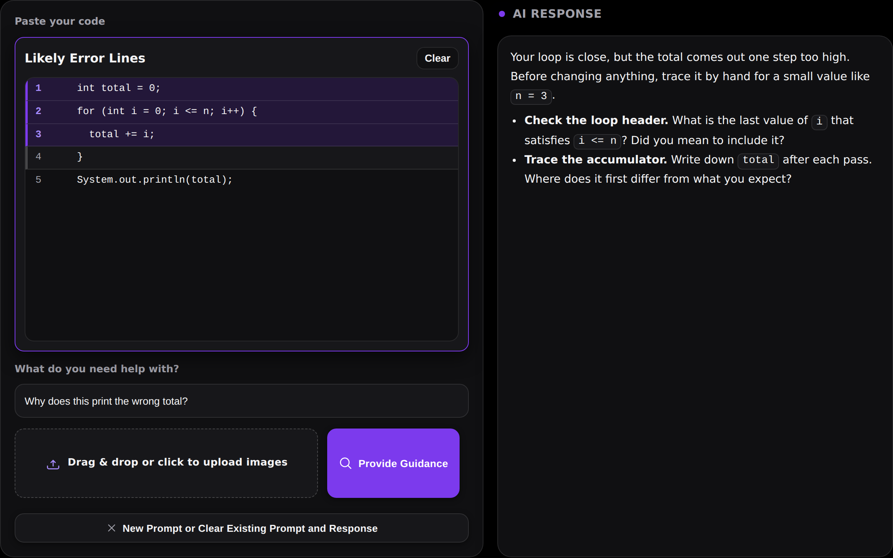
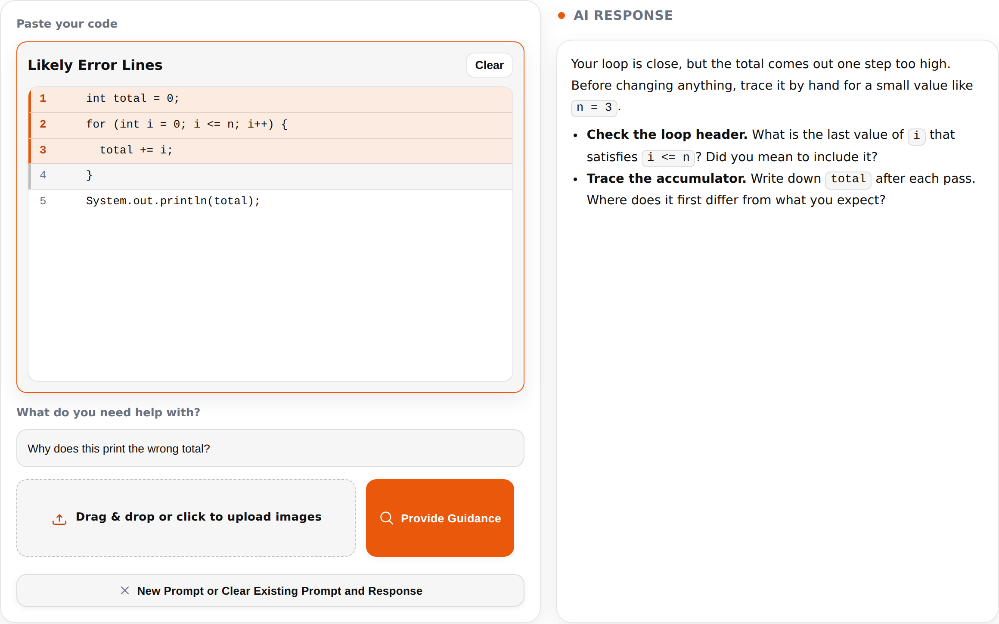
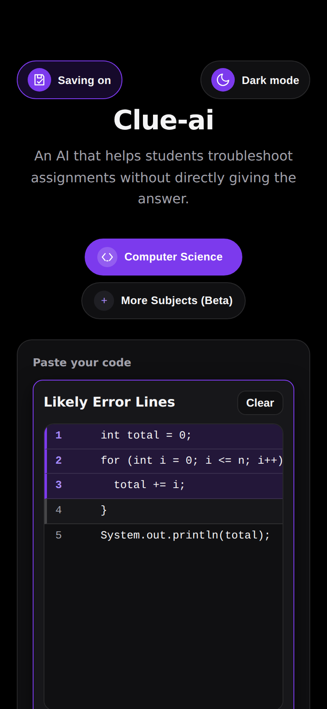
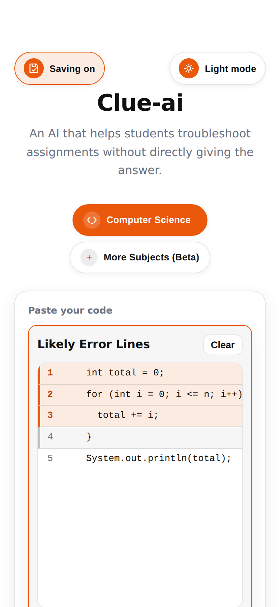

<p align="center">
  
</p>

<h1 align="center">Clue.ai</h1>

<p align="center">
  An AI learning assistant that helps students troubleshoot assignments without spoiling the answer.<br>
  <a href="https://clue-ai.vercel.app/">clue-ai.vercel.app</a> <strong>(API currently down)</strong>
</p>

<p align="center">
  
  
  
</p>

## 🚀 Screenshots


<table>
  <tr>
    <td width="50%"></td>
    <td width="50%"></td>
  </tr>
  <tr>
    <td align="center">Dark mode</td>
    <td align="center">Light mode</td>
  </tr>
  <tr>
    <td align="center"></td>
    <td align="center"></td>
  </tr>
  <tr>
    <td align="center">Phone, dark</td>
    <td align="center">Phone, light</td>
  </tr>
</table>

---

It works like a teacher who nudges you in the right direction and asks good questions instead of handing over a solution, so you actually learn the reasoning.

## ✨ What it does

* 📄 **Paste your assignment.** Any snippet you're stuck on.
* 🖼️ **Upload images and screenshots.** Questions, diagrams, lab prompts. You can also drop source files straight into the text box.
* 💬 **Describe your problem.** Tell Clue.ai what confuses you, or just say "help debug".
* 🤖 **Get coaching, not answers.** You get hints, the lines worth checking, and clarifying questions.

---

## 🏃 Running it locally

```bash
npm install
echo "OPENAI_API_KEY=sk-..." > .env.local
npm run dev
```

Then open [http://localhost:3000](http://localhost:3000).

`OPENAI_API_KEY` is the only environment variable. It is read on the server and never reaches the browser.

### Commands

| Command | What it does |
| --- | --- |
| `npm run dev` | Dev server with hot reload |
| `npm run build` | Production build |
| `npm start` | Serve a production build |
| `npm test` | Run the tests |
| `npm run test:watch` | Re-run tests on change |
| `npm run test:coverage` | Tests with a coverage report |
| `npm run typecheck` | `tsc --noEmit` |
| `npm run validate:data` | Check every file in `data/` |
| `npm run generate:tokens` | Rebuild the CSS colours from `data/theme.json` |
| `npm run verify` | Typecheck, data checks and tests |

---

## 🏗️ How it's organised

One page, three API routes. Content lives in `data/`, logic in `lib/`, rendering in `app/`.

```
data/                      Content and config. No code.
  subjects.json              The subject modes and all their copy
  strings.json               Every user-visible string
  uploads.json               Accepted file extensions
  config.json                Models, limits, storage keys, defaults
  theme.json                 Colours for dark and light
  prompts/
    help.md  locate.md  extract.md              System prompts
    help.user.md  locate.user.md  extract.user.md   User-turn templates
    fragments.json                              Pieces filled into the templates

lib/                       Logic. No JSX.
  subjects.ts, locator.ts, numbering.ts, fences.ts, uploads.ts, history.ts
                             Pure rules, each tested on its own
  storage.ts                 Guarded localStorage access
  api-client.ts              The browser's calls to the three routes
  hooks/                     useTheme, useHistory, useAttachments,
                             useLineHints, useGuidance
  server/
    ai/                      One module per endpoint: builds the prompt, calls the model
    templates.ts, prompts.ts Load the files in data/prompts/
    openai.ts, http.ts, route.ts   Client, JSON replies, shared route wrapper

app/
  page.tsx, layout.tsx       Route entry and document shell
  components/                ClueWorkspace composes header/, editor/,
                             response/, history/ and shared/
  styles/                    Per-feature stylesheets, colours from tokens only
  api/help, api/locate, api/extract    Thin routes on top of lib/server/route.ts

assets/                    Logo (brand/) and README screenshots (screenshots/)
scripts/                   Extraction and validation tooling
tests/                     Vitest suites
```

### How a request works

Pressing **Provide Guidance** runs up to three calls:

1. `POST /api/extract` runs only when images are attached and the text box is empty. It transcribes the screenshots and keeps the student's mistakes instead of fixing them. If you paste code and also attach a screenshot, your paste is used and never overwritten.
2. `POST /api/help` returns the hints shown in the right-hand panel.
3. `POST /api/locate` returns line ranges as plain text, which the browser turns into the highlight overlay.

The locate reply is plain text rather than JSON on purpose. `lib/locator.ts` copes with a missing header or an odd dash, so a formatting slip means fewer highlights instead of a failed request.

`lib/numbering.ts` numbers the lines the model sees and `lib/locator.ts` numbers the lines the browser highlights. If those disagree every highlight lands on the wrong row and nothing errors, so they sit next to each other and are tested together.

---

## 📝 Changing things without writing code

Everything here is a `data/` edit. Run `npm run validate:data` afterwards and it will tell you if something is missing or inconsistent.

### Add a subject

Append an object to `subjects` in `data/subjects.json`:

```json
{
  "id": "history",
  "label": "History",
  "shortLabel": "History",
  "apiLabel": "History",
  "hint": "BETA",
  "codeLabel": "Paste your source or essay prompt",
  "codePlaceholder": "// Paste the passage, prompt, or outline.\n// Attach images of documents if helpful.",
  "uploadAriaLabel": "Upload image of your source or prompt",
  "icon": { "kind": "glyph", "value": "📜" }
}
```

| Field | Where it shows up |
| --- | --- |
| `id` | Sent to the API and stored in history. Lowercase, no spaces. |
| `label` | The full name on the subject chip |
| `shortLabel` | The history tag and the empty-state sentence |
| `apiLabel` | The name the AI is given in the prompt |
| `hint` | Badge text on the chip. Use `""` for no badge. |
| `codeLabel` | Heading above the text box |
| `codePlaceholder` | Placeholder inside the text box |
| `uploadAriaLabel` | Accessible name for the file input |
| `icon` | `{"kind": "glyph", "value": "📜"}` for a character, or `{"kind": "component", "value": "code"}` for an SVG from `app/components/Icons.tsx` |

The chip, the labels, the prompt wording and the history tag all follow from this. Only the first subject in the list shows before "More Subjects" is expanded.

### Change wording

Edit `data/strings.json`. Leave `{action}`, `{subject}` and `{count}` in place, they get filled in at render time.

### Change what the AI does

Edit the Markdown in `data/prompts/`. These are read from disk at runtime, so there is no code change involved.

Each endpoint has two files. `help.md` is the system prompt, the rules the model follows. `help.user.md` is the message wrapped around the student's input, with slots like `{ask}`, `{subject}` and `{code}` that get filled in. Keep the slots; `npm run validate:data` fails if one goes missing. A line that holds only a slot disappears when its value is empty, which is how the extract prompt leaves out its subject line.

Be careful with `locate.md`. Its `LINES:` and `- start-end | reason` and `NOTE:` format is what `lib/locator.ts` parses. A test checks the format is still documented there.

### Accept another file type

Add the extension without a leading dot to `textExtensions` in `data/uploads.json`. It feeds both the file picker and the drop handler, so the two cannot drift apart.

### Change colours

Edit `data/theme.json`, then run `npm run generate:tokens`. Don't edit `app/styles/tokens.generated.css` directly, `npm run validate:data` fails if it is stale.

Dark mode is black with purple and light mode is white with orange. The stylesheets only ever use `var(--token)`, never a literal colour, so a theme is nothing more than a set of token values and the validator fails if a literal sneaks in. Each token is described at the top of `theme.json`.

The four palettes are in a deliberate order. `base` and `systemLight` have equal CSS specificity, so only source order separates them. The `theme-dark` and `theme-light` blocks carry an extra class and win from anywhere, which is how the manual toggle beats the OS setting.

### Change a model or a limit

Edit `data/config.json`. It holds the model and retention flag per endpoint, the prompt truncation cap, the history cap, the localStorage key names, and the startup defaults.

---

## 🧰 Scripts

`validate-data.mjs` runs 31 checks over `data/`, including round-trips against the original source and a check that no stylesheet names a colour directly. `generate-tokens.mjs` turns `data/theme.json` into CSS. The `extract-*.mjs` scripts are the one-shot tools that pulled the data out of the source in the first place, kept because the validator re-runs them.

---

## 🛠️ Built with

Next.js 15 (App Router), React 19, TypeScript, the OpenAI Responses API, and Vitest.

---

Built for students by Edison Law, 2025. San Ramon Valley Unified School District.
